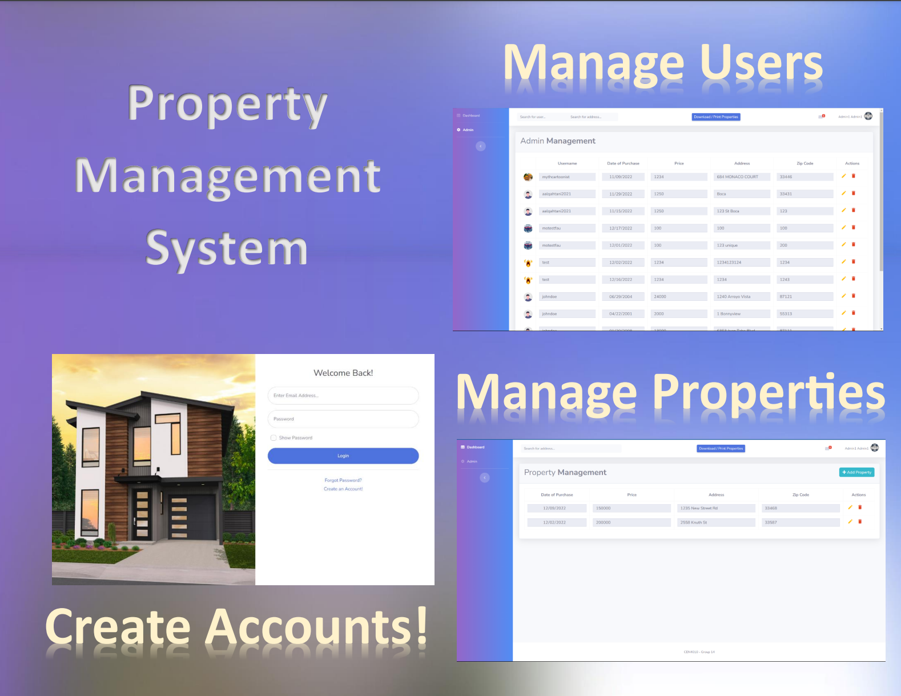

# [Property Management System](https://github.com/KevinTudor/PropertyManagementSystem/tree/main)

## Status

## Introduction
Investing in property entails a multitude of benefits but also poses significant challenges and risks such as natural disasters and theft. Our team is proposing a web-based personal
property management system that can enable property owners to reap the benefits of their investments while ensuring their property is properly documented and accessible for insurance agencies in times of crisis. 

## Team
- Kevin Tudor
- Christian Fenn
- Ibrahim Elhabashy

## Project Timeline
- Start Date: August 2022
- End Date: December 2022

## Task
Our team will utilize the React JavaScript library to develop and implement the system which will be equipped with multiple features to assist the user in recording and managing their
property. The user will be able to create personal accounts in which they can add, remove, and edit their owned property. Property documented in the system should include legal documentation as deeds and titles (optional), property address, purchase receipts, images, videos, and detailed descriptions. The user will also be able to print, search, download and
securely share property records with other authorized users (super-users) or insurance agencies. 

## Criteria
Citizen (User):
- Create secure property account in which they can add, remove, edit print, search, and download property records.
- Admin page to view users and their properties.
- Allow other citizens to access their account.

## Technology Stack
The application was built using the following technologies:
- JavaScript
- React.js
- MongoDB
- Boostrap

[SB Admin 2](https://startbootstrap.com/theme/sb-admin-2/) is an open source admin dashboard theme for [Bootstrap](https://getbootstrap.com/) created by [Start Bootstrap](https://startbootstrap.com/).
Start Bootstrap was created by and is maintained by **[David Miller](https://davidmiller.io/)**.
Start Bootstrap is based on the [Bootstrap](https://getbootstrap.com/) framework created by [Mark Otto](https://twitter.com/mdo) and [Jacob Thorton](https://twitter.com/fat).

## Installation and Usage
After cloning the repository, run `npm install` and then run `npm start` which will open up a preview of the template in your default browser, watch for changes to core template files, and live reload the browser when changes are saved. You can view the `gulpfile.js` to see which tasks are included with the dev environment.

## Current State and Future Plans
The website is currently able to meet the criteria for user input and admin managment but it still requires the share feature. 

## Copyright and License
Copyright 2013-2021 Start Bootstrap LLC. Code released under the [MIT](https://github.com/StartBootstrap/startbootstrap-resume/blob/master/LICENSE) license.
